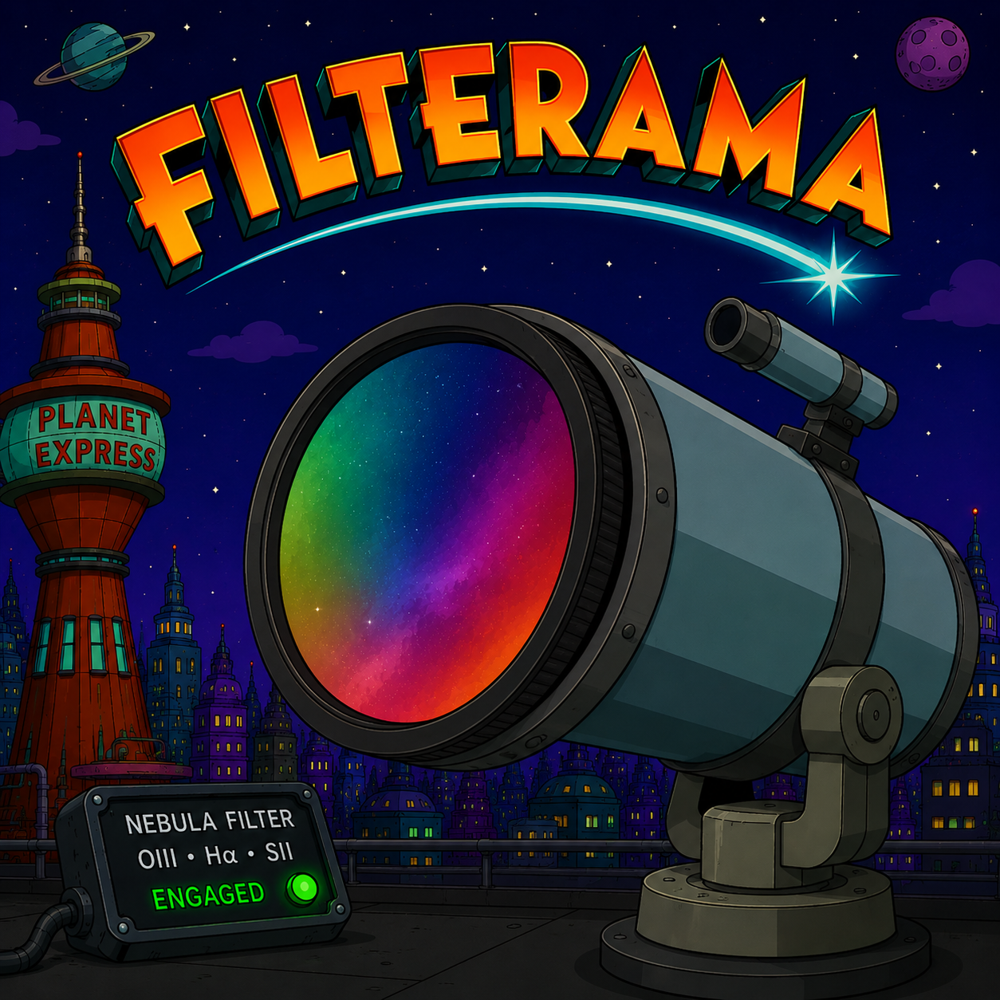

# Filterama



Filterama is a desktop application for visualizing and analyzing astronomical filter and sensor response curves.
It is built with Python, PyQt6, and Matplotlib.

## What The App Does

Filterama lets you compare and combine multiple spectral components in one interactive plot:

- Filter transmission curves from CSV files
- White reference spectra from local CSV files or the `pyckles` spectral library
- Camera sensor RGB response curves from CSV or FITS (`SASP_data.fits`)
- Optional sensor QE curve (quantum efficiency)
- Computed "system response" per RGB channel
- Near-IR integration (>= 750 nm) with warning when IR response is high

The UI includes:

- Multi-select filter list (checkboxes)
- White reference dropdown
- Camera sensor dropdown
- Sensor QE dropdown
- Dynamic legend and spectral background/annotations
- Status panel for missing resources and IR warnings

## Credits

The About dialog credits: Setiastro Suite Pro, PixInsight, and Siril.

## Requirements

- Python 3.10+ (tested in a virtual environment)
- macOS for native `.app` build with `py2app`
- Docker (optional, only needed for Windows `.exe` cross-build)

Main Python dependencies are listed in [requirements.txt](requirements.txt).

## Run From Source

```bash
python -m venv .venv
source .venv/bin/activate
python -m pip install --upgrade pip
python -m pip install -r requirements.txt
python src/Filterama.py
```

## Build

### Build macOS App (`.app`) with py2app

```bash
source .venv/bin/activate
python -m pip install --upgrade pip setuptools wheel py2app
python -m pip install -r requirements.txt
python setup.py py2app
```

Build output:

- `dist/Filterama.app`

You can launch it with:

```bash
./run_filterama.sh
```

### Build Windows App (`.exe`) with Docker

This project includes a Docker-based Windows build flow (PyInstaller + Wine).

```bash
./build_windows_docker.sh
```

Build output:

- `dist/Filterama/Filterama.exe`

See [WINDOWS_BUILD_DOCKER.md](WINDOWS_BUILD_DOCKER.md) for details.

## Resource/Data Layout

Filterama expects these resource folders/files:

- `Resources/Filter` (filter CSV files)
- `Resources/WhiteReferences` (white reference CSV files)
- `Resources/SensorFilters` (sensor RGB CSV files)
- `Resources/SensorQEs` (sensor QE CSV files)
- `Resources/FilterFITs/SASP_data.fits` (sensor curves in FITS)

If something is missing, the app shows warnings in the Status area.

## CSV Format

Filter CSV files support two formats:

1. Structured key/value CSV
2. Legacy 2-column CSV

### Structured format (recommended)

Expected keys:

- `type`
- `name`
- `channel`
- `wavelength`
- `transmission`

Notes:

- `wavelength` and `transmission` are comma-separated value lists
- `transmission` can be in `0..1` or `0..100` (the app scales `0..1` to percent)

## Project Structure

- [src/Filterama.py](src/Filterama.py): application entry point
- [src/filterama_view.py](src/filterama_view.py): UI, plotting, interaction logic
- [src/filterama_controller.py](src/filterama_controller.py): event handling
- [src/filterama_model.py](src/filterama_model.py): data loading and numeric helpers
- [src/filterama_common.py](src/filterama_common.py): shared parsing, plotting helpers, logging

## Publishing On GitHub

